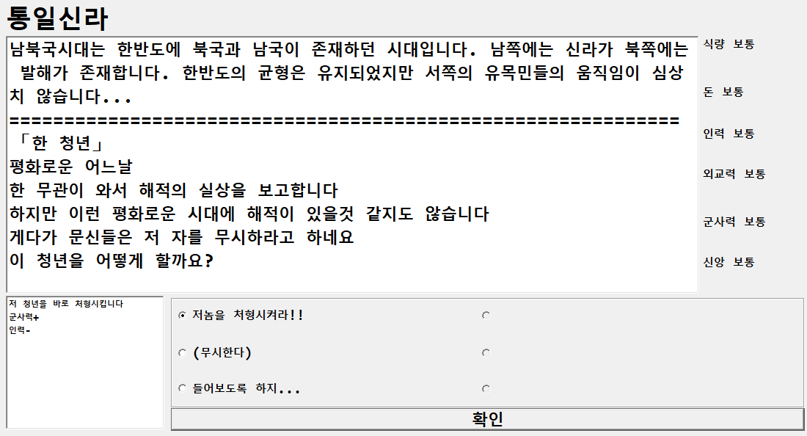

# 한스토리(DGSW 2019 HACKATON)

## 게임 소개

삼국시대부터 현대시대까지를 다루는 TextRPG 게임입니다.

당신은 한 국가의 지도자가 되어서 삼국통일, 당나라의 침공, 무신정변, 위화도 회군, 임진왜란... 같은 
역사적 사건을 경험할 수 있습니다.

식량, 돈, 보통, 인력, 외교력, 군사력을 관리하여 현대시대까지 도달하십시요!

각 선택지는 상황에따라 당신에게 이득을 줄 수도 손해를 끼칠 수도 있습니다.

## 팀원 역할  

최현철 윤재상 한주환 김진혁 전지수 박지현

C++의 winapi를 사용했으며, 최현철이 기획 및 발표물 제작, 윤재상이 UI와 미들웨어 개발 
한주환, 김진혁, 전지수, 박지현이 각 역사 당 컨테츠 제작을 했습니다.

# 여담
아직 1학기라 자신의 실력을 걱정하는 1학년들도 부담스러워 하지 않고 개발해주어 감사하게 생각합니다.
